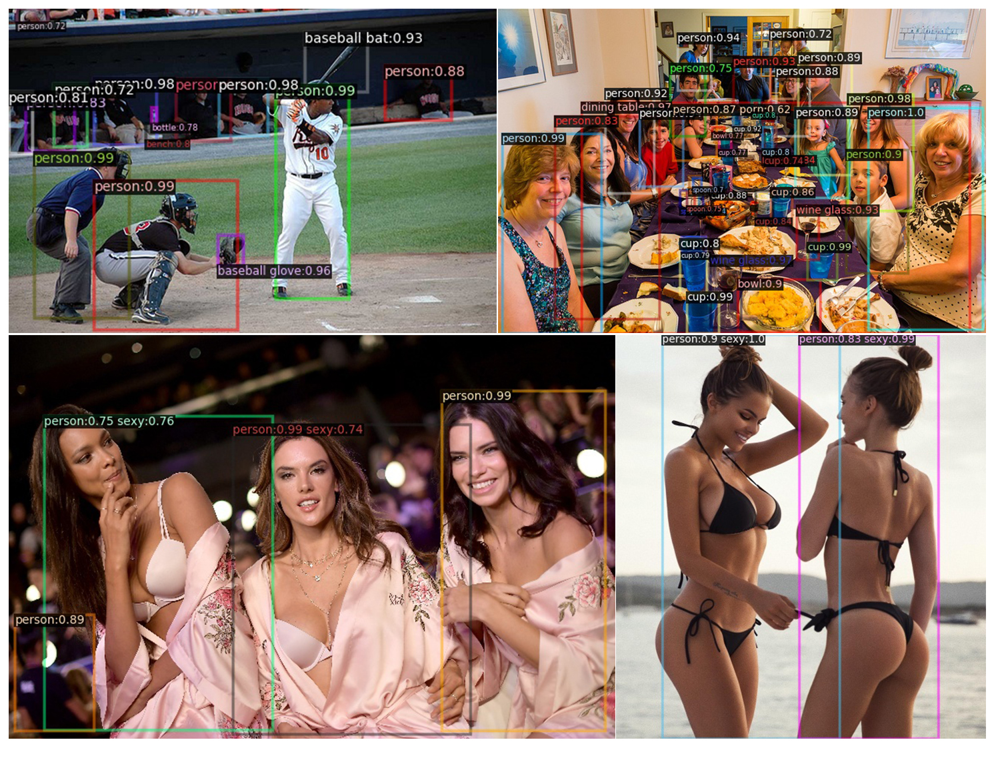

# Sexy Yolo

****************

## Introduction

A hierarchical detection method based on Yolov3, which can work on joint classification and detection dataset, such as 
COCO and NSFW. So that Yolo could detect coco categories and sexy or porn person simultaneously. (Tensorflow 1.x) 

<div align="center">
   
</div>

****************

## Requirements

Python version: >=Python3.6  
Packages:  
- tensorflow >=1.13 (do not support Tensorflow2.0)
- opencv-python
- numpy
- pyyaml

****************

## Quick Start

if model weights is ready and basic code is cloned. Please edit configs/XXX.yaml, add your local model weights path to MODEL:MODEL_WEIGHTS:, such as "path/to/yolov3".

#### common coco:  
```bashrc
$ python tools/infer.py test_pic.jpg(or folder) --config-file configs/Yolov3_Coco.yaml --result-file data/demo_result
```
#### sexy and coco:
```bashrc
$ python tools/infer.py test_pic.jpg(or folder) --config-file configs/Yolov3_Joint_CocoAndNsfw.yaml --result-file data/demo_result
```
****************

## Model weights (model weights is uploading, please wait)

Two model weights are provided: common COCO model and Sexy&COCO model.  
Common COCO weights is converted from author of Yolov3(pjreddie.com), Sexy&COCO weights are trained on image size of 416 * 416, so mAP is less than the former but close to Yolov3 paper's 416 image size model mAP. 

    
Name|inference time(s/im)|category|AP@IoU=0.50:0.95|AP@IoU=0.50|AP@IoU=0.75|download   
------:|:------:|:------:|:------:|:------:|:------:|:------:
COCO|0.046|80|0.357|0.616|0.376|[model]()  
SexyCOCO|0.047|83|0.309|0.551|0.308|[model]() 

****************

## Train your own data

Sexy Yolo support train your own detection dataset and also support joint classification and detection dataset.  

### Train detection dataset
The detection annotation's format must be same as COCO's format. Add training dataset photo folder and annotation file to config file and run:
```bashrc
$ python tools/train.py --config-file configs/Yolov3_Coco.yaml
```
### Train joint classification and detection dataset

As for classification dataset, put all the classification photos into each folder, the folder's name is catogory's name. Make your dataset folder structure as:

- NSFW
- -train
- --neutral
- --sexy
- --porn

- -val
- --neutral
- --sexy
- --porn

Then run:
```bashrc
$ python tools/joint_json_creator.py path/to/NSFW
```
After dataset is ready, edit Yolov3_Joint_CocoAndNsfw.yaml with new dataset path. Run this start to train:
```bashrc
python tools/train.py --config-file configs/Yolov3_Joint_CocoAndNsfw.yaml
```

You can change config parameters by editing config file.
 
****************

### Dataset

COCO dataset: http://cocodataset.org/  
NSFW dataset: https://github.com/alex000kim/nsfw_data_scraper

****************

## Evaluate model

CocoApi is needed, please install cocoapi first: https://github.com/cocodataset/cocoapi
Run this to evaluate your model:
```bashrc
$ python tools/eval_on_coco.py --config-file configs/Yolov3_Joint_CocoAndNsfw.yaml
```
****************
## More Details

- please see the blog [Description and discussion]()